# Smart Notes

## Description

Smart Notes is an AI-powered note-taking application designed to streamline the process of capturing and organizing information from audio recordings. It allows users to record audio directly within the app or upload existing audio files. This audio is then processed by an AI service (currently mocked) to generate structured notes, including a full transcript, a concise summary, key takeaways, and actionable items. The app provides a rich playback experience with synchronized text highlighting, variable speed controls, and a visual timeline. All notes are stored locally for easy access and can be searched by content and tags.

## Features

*   **Audio Recording:** Record audio directly in the app with real-time waveform visualization.
*   **Audio Upload:** Upload existing audio files in MP3, WAV, and M4A formats.
*   **AI-Powered Processing:** (Mocked) Send audio to an AI service to extract:
    *   Full Transcript
    *   Summary
    *   Key Points
    *   Action Items
*   **Structured Note Display:** View AI-generated content in an organized and easy-to-read layout.
*   **Synchronized Playback:**
    *   **Real-time Segment Highlighting:** As audio plays, the corresponding text segment in the transcript is highlighted.
    *   **Seeking Controls:** Easily navigate through the audio.
    *   **Variable Playback Speed:** Adjust playback speed from 0.5x to 2.0x.
*   **Progress & Error Handling:** Visual feedback on AI processing progress and clear error messages.
*   **Search Functionality:** Search through all notes by their content and associated tags.
*   **Local Storage:** Notes are stored locally using Hive for offline access and persistence.

## Getting Started

### Prerequisites

*   Flutter SDK installed.
*   An IDE like Android Studio or VS Code with the Flutter plugin.

### Installation & Running

1.  **Clone the repository (if applicable):** 
```bash 
git clone https://github.com/AR-Rahat/smart-notes.git
cd smart_notes
```
2.  **Get Flutter packages:** 
```bash 
flutter pub get
```
3.  **Run the build runner:** This project uses code generation. Before running the app, you need to execute the build runner: 
```bash 
dart run build_runner build --delete-conflicting-outputs
```
4. For continuous generation during development, you can use: 
```bash 
dart run build_runner watch --delete-conflicting-outputs
```

Select your target device (emulator/simulator or physical device) when prompted.

## Technologies Used

*   **Flutter & Dart:** For cross-platform application development.
*   **Hive:** A lightweight and fast key-value database for local storage.
*   **Cubit (from `flutter_bloc`):** For state management, providing a simple and predictable way to manage application state.
*   **Clean Architecture:** The project follows Clean Architecture principles to ensure a separation of concerns, making the codebase more testable, maintainable, and scalable.

## AI Response Format (Mocked)

The application is designed to process an AI response with the following structure:

```JSON
{
  "metadata": {
    "language": null,
    "content": null,
    "topics": null,
    "duration": 146.94
  },
  "segments": [
    {
      "start_time": 0,
      "end_time": 15,
      "content": "Content of ai processing"
    }
  ]
}

```


**Example:**

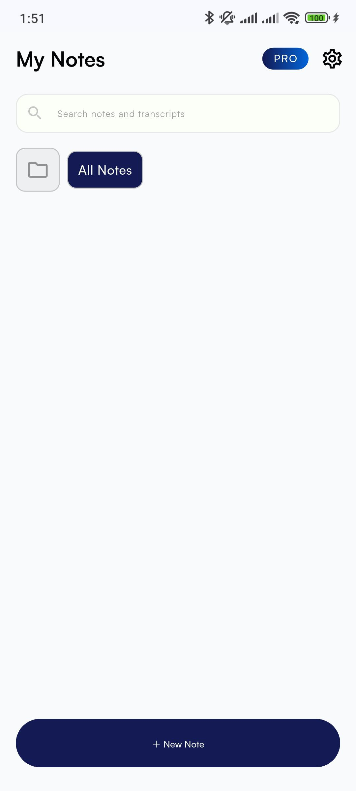
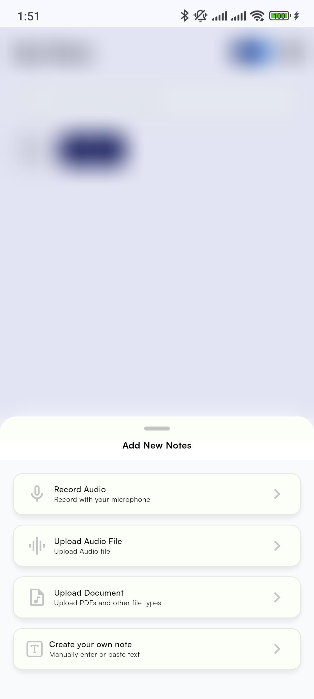
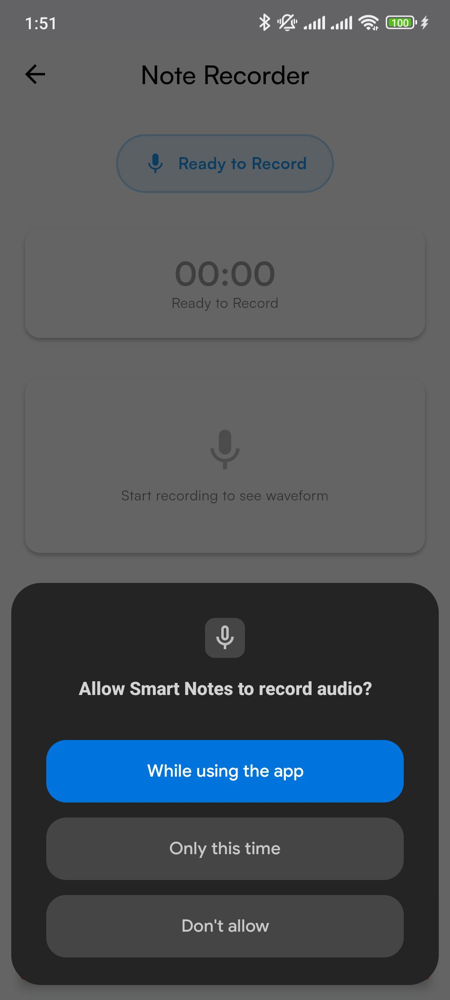
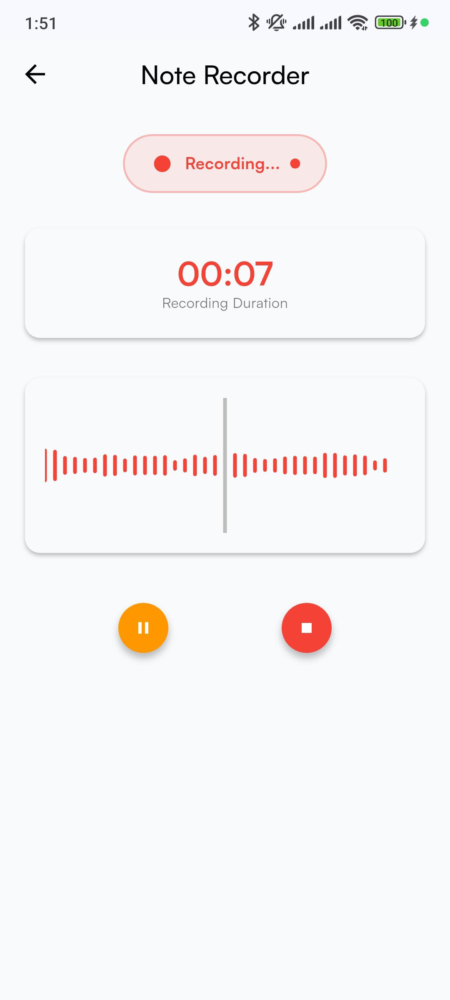
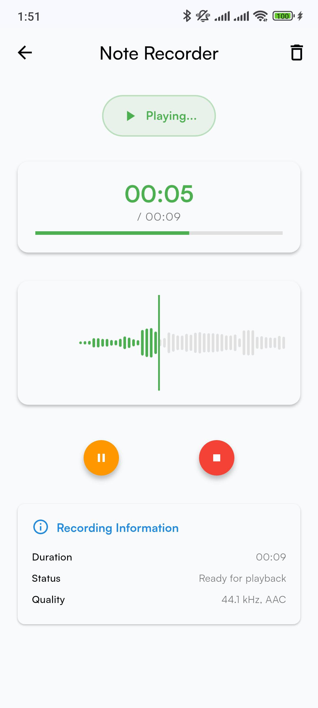
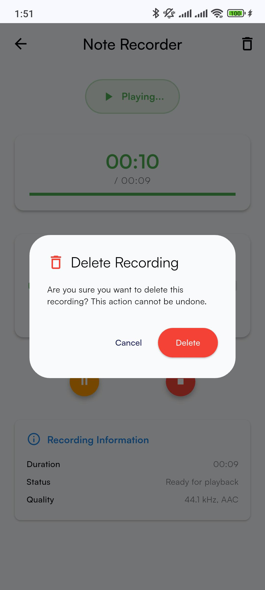
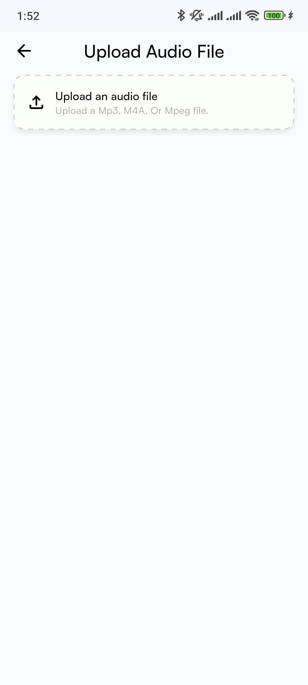
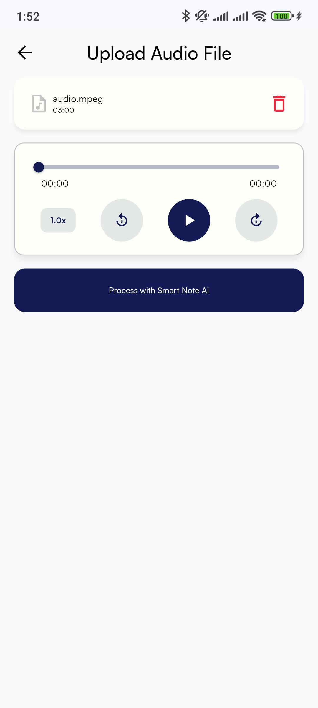
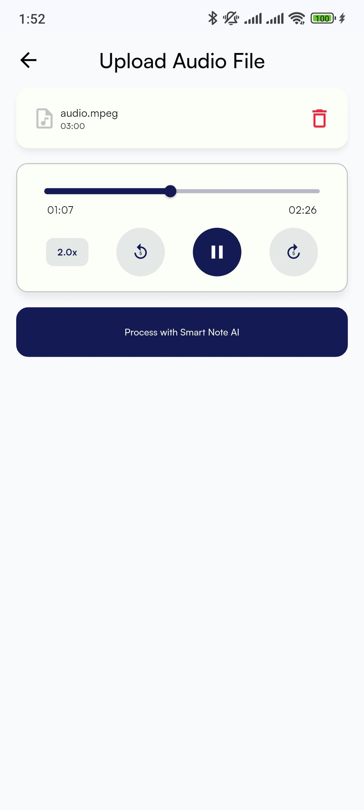
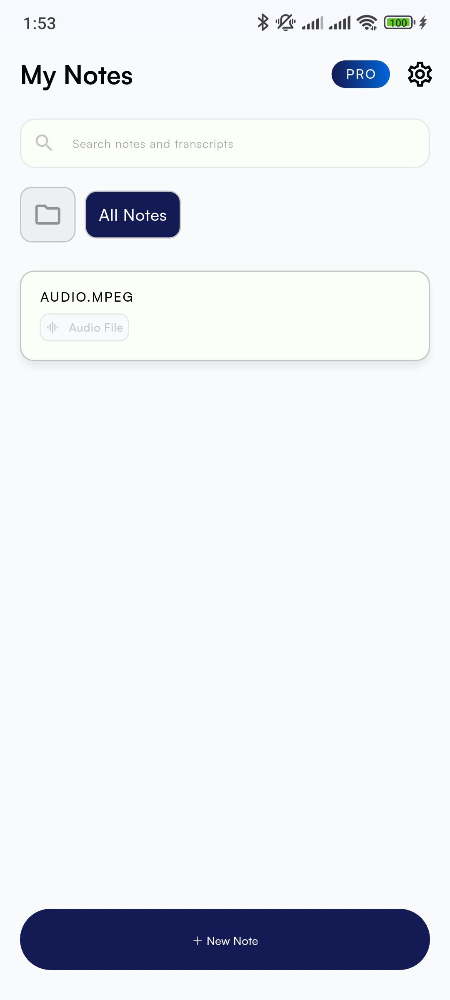
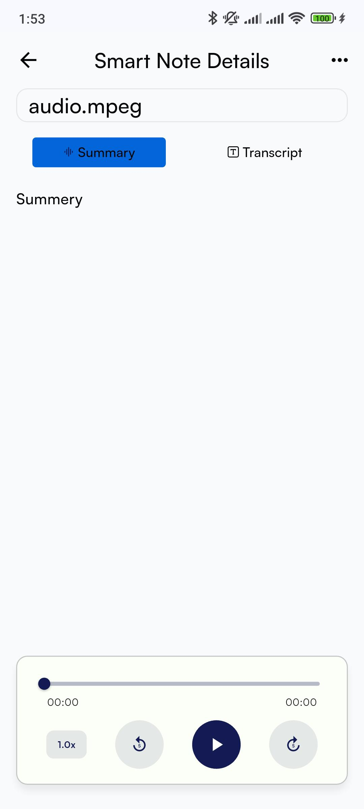
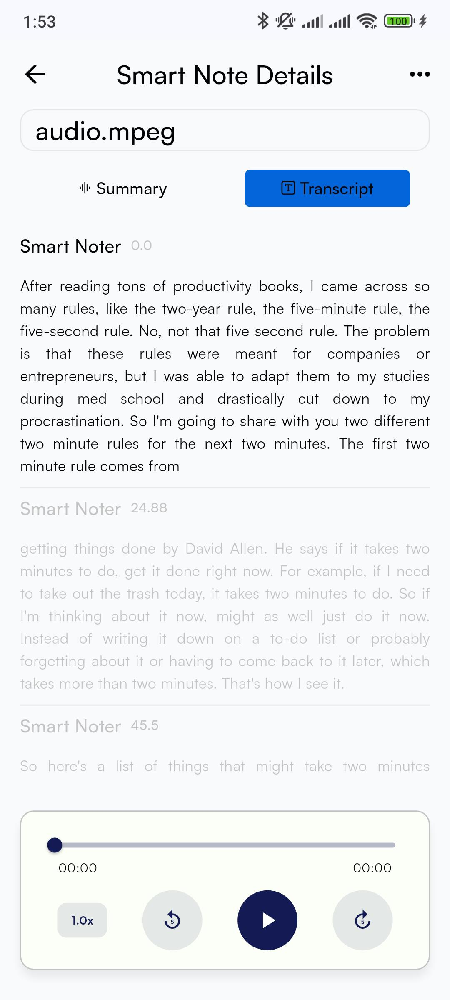
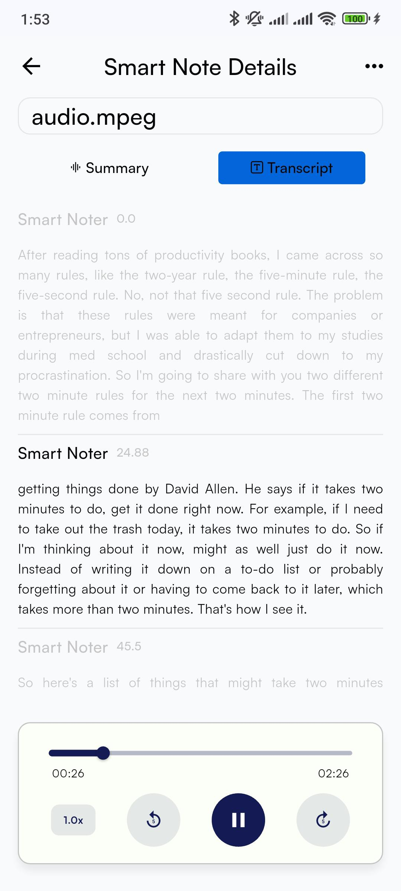
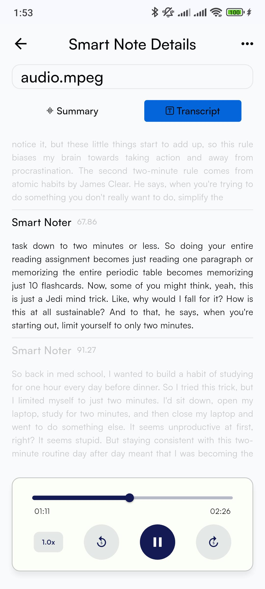